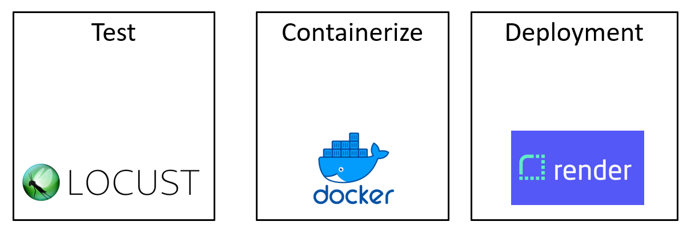
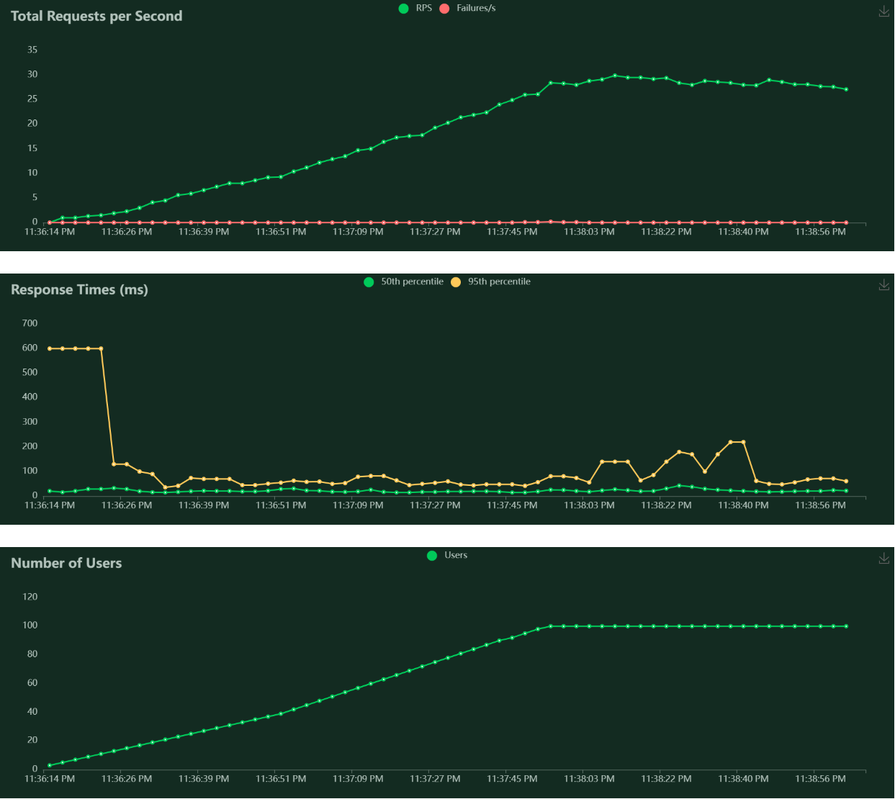

# Weather-To-Watt (Solar Efficiency Prediction Microservice)

<p align="center">
  
</p>

#### Table of contents
1. [Project Overview](#Project-Overview)
2. [Objective](#Objective)
3. [Model Development](#Model-Development)
4. [How do you use this API?](#API-Usage)
5. [Performance Tests with Locust](#Performance-Tests-with-Locust)

   
## Project Overview
Solar power generation is highly dependent on various meteorological factors. Understanding and predicting the efficiency of solar energy production under clear sky conditions (a state where solar irradiance is not hindered by clouds) is crucial for optimizing solar panel performance and energy grid management. 

This project focuses on creating a microservice adept at predicting solar energy efficiency. It harnesses cutting-edge machine learning techniques, along with extensive weather data, to forecast the performance under clear sky conditions accurately.  The accuracy of these predictions is key to streamlining energy planning, minimizing resource wastage, and bolstering the dependability of solar power as a renewable energy option. The system's architecture employs FastAPI for robust API implementation and leverages the open-source Locust framework for load testing. **This approach assesses the API's capacity to manage its intended workload, pinpoint bottlenecks, and detect any performance issues, thereby guaranteeing efficiency and responsiveness that meet the requirements of contemporary, eco-friendly energy solutions.**

## Objective

The primary objective of this project is to develop and validate an API that leverges a multi-label regression model to predict key solar irradiance components: **Diffuse Horizontal Irradiance (DHI)**, **Direct Normal Irradiance (DNI)**, and **Global Horizontal Irradiance (GHI)**. The model utilizes a comprehensive set of input parameters, including temperature, dew point, surface albedo, atmospheric pressure, wind conditions, solar zenith angle, and more, to provide precise and location-specific predictions via a microservice.

## Model Development

I adopted a **multi-label regression** strategy to enable simultaneous predictions of Diffuse Horizontal Irradiance (DHI), Direct Normal Irradiance (DNI), and Global Horizontal Irradiance (GHI). This approach allows for a detailed analysis of solar irradiance in clear sky conditions. **Central to this microservice is the predictive model, for which I chose the CatBoost algorithm. Renowned for its high performance as a gradient boosting framework, CatBoost excels in managing datasets that are both diverse and complex.**

To ensure the model's accuracy and reliability, it was trained on a historical dataset encompassing both weather data and solar irradiance measurements. This training process emphasized the following key inputs:
  - **Timestamp**: Date and time of measurement
  - **Temperature**: Degrees Celsius (°C)
  - **Dew Point**: Degrees Celsius (°C)
  - **Surface Albedo:** Decimal fraction between 0 and 1
  - **Pressure:** Hectopascals (hPa)
  - **Wind Direction:** Degrees (°)
  - **Wind Speed:** Meters per second (m/s)
  - **Ozone:** Dobson Units (DU)
  - **Cloud Type:** Classification scheme (0-9) indicating cloud cover type
  - **Solar Zenith Angle:** Degrees (°)
  - **Precipitable Water:** Millimeters (mm)
  - **Relative Humidity:** Percentage (%)

## System Architecture

<p align="left">
  
</p>

Roles of the different components in the application setup:

1. **FastAPI:** Manages incoming HTTP requests, validates input data, and invokes the machine learning model for predictions.
2. **Docker:** Containers run the FastAPI application and the machine learning model, ensuring consistency across different environments.
3. **Machine Learning Model:** Hosted within a Docker container and called upon by FastAPI to provide predictions based on meteorological data inputs.
4. **Locust:** Conducts load testing by simulating traffic to the API, ensuring the service can handle the expected load without performance degradation.

## API Usage

Here's a streamlined guide for querying the prediction endpoint of the machine learning API using a Python script. The following sample code employs the `requests` library to transmit data to the API and retrieve the resulting predictions.

```python
import requests
import json

# The correct API endpoint for predictions
api_endpoint = 'https://weather-to-watt-serv.onrender.com/predict'

# Example data to be sent to the API for prediction
data = {
    "Timestamp": "2024-01-01 01:00:00",
    "Temperature":13,
    "Dew_Point":7.0,
    "Surface_Albedo":0.22,
    "Pressure":1000,
    "Wind_Direction":126,
    "Wind_Speed":1,
    "Ozone":0.256, "Cloud_Type":6,
    "Solar_Zenith_Angle":160,
    "Precipitable_Water":1.4,"Relative_Humidity":67,
}
# Send a POST request to the API
response = requests.post(api_endpoint, json=data)

# Check if the request was successful
if response.status_code == 200:
    # Parse the prediction result from the response
    prediction = response.json()
    print("Prediction:", prediction)
else:
    print(f"Failed to get a prediction. Status code: {response.status_code}")
    print("Response:", response.json())
```

## Performance Tests with Locust 🦗

1. Create a Python virtual environment and install the necessary dependencies with:
    ```
    $ python3 -m venv env
    $ pip install -r requirements.txt
    ```

2. Specify command to run a Locust server for performance tests on your machine. 
    ```
    $ locust -f tests/locust_test.py
    ```

3. We can access it via browser, the default port is 8989. The tests should appear at http://127.0.0.1:8089/
   
4. Next, we need to provide information about tests to Locust. In the screen, we define how many users (ie. processes) we want to create. Also, we need to define how fast those processes are going to be created (**spawn rate**). Finally, we need to define the address of the API. **We don’t need to define the endpoint.**

<p align="center">
  
</p>

- Number of Users and requests per second  <Test>

<p align="center">
  
</p>


